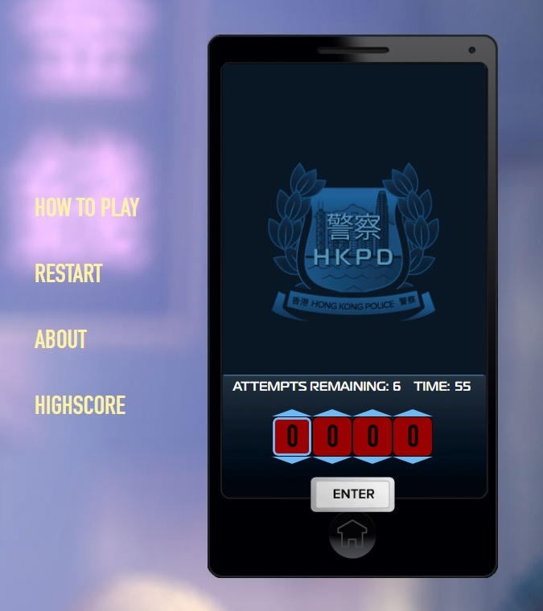

<a href="https://en.wikipedia.org/wiki/Sleeping_Dogs_(video_game)" target="_blank" rel="noopener noreferrer">Sleeping Dogs</a> Camera Hacking mini-game (<a href="https://en.wikipedia.org/wiki/Bulls_and_Cows" target="_blank" rel="noopener noreferrer">Bulls and Cows</a> variation).
 
<b>Tech stack</b>: React 16.3, TypeScript, MobX, SCSS, Firebase to save user info (name, company, code, time, attempts, date, comment), average time/attempts, wins/lost stats.

 
<b>TODO</b>

<ul>
  <li>REFACTORING</li>
  <li>Improve 1st place calculcation based on time + attempts (it's time only now)</li>
  <li>Make timer in ms?</li>
  <li>Scoreboard pagination?</li>
  <li>Add easter eggs in Scoreboard for unique numbers</li>
  <li>Add difficulty setting to play with limited time (like in the game)</li>
  <li>Form validation?</li>
  <li>Two player mode?</li>
  <li>Add default (indeterminate) digit input state</li>
  <li>Adjust design</li>
</ul>

<b>Bugs</b>

<ul>
  <li>DIN Condensed font has wrong line height on MacOS</li>
</ul>

 
## :hammer_and_wrench: Installation

- \$ yarn
- \$ yarn start - dev
- \$ yarn build - prod
