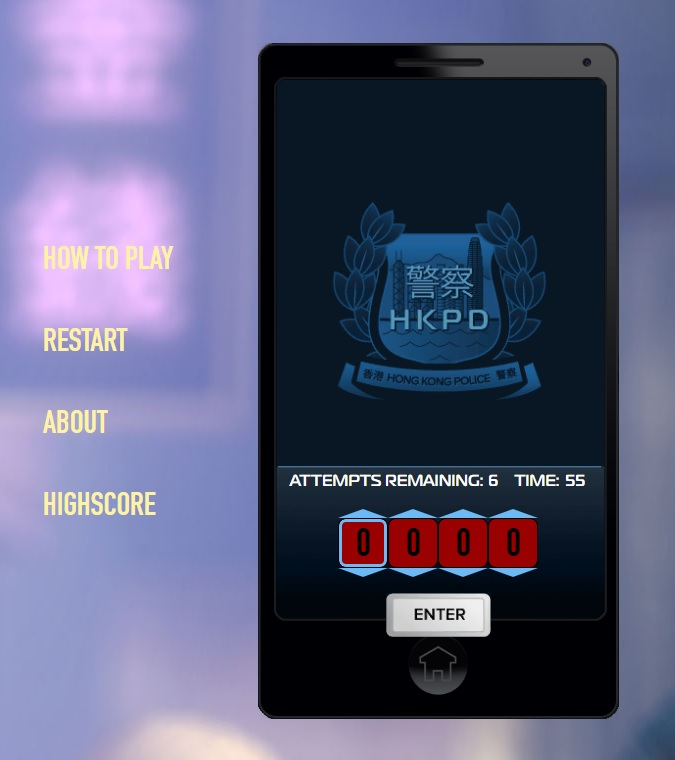

<a href="https://en.wikipedia.org/wiki/Sleeping_Dogs_(video_game)" target="_blank" rel="noopener noreferrer">Sleeping Dogs</a> Camera Hacking mini-game (<a href="https://en.wikipedia.org/wiki/Bulls_and_Cows" target="_blank" rel="noopener noreferrer">Bulls and Cows</a> variation).
 
 
<b>Tech stack</b>: React 19, TypeScript, Vite, TanStack Query (remote data), React Context (game state), SCSS, Firebase to save user info (name, company, code, time, attempts, date, comment), average time/attempts, wins/lost stats.
 
 

See [docs/REQUESTS.md](docs/REQUESTS.md) for how GitHub and Firestore requests work.
 
 

 

## :construction_worker: To Do

<ul>
  <li>Improve 1st place calculcation based on time + attempts (it's time only now)</li>
  <li>Add easter eggs in Scoreboard for unique numbers</li>
  <li>Form validation?</li>
  <li>Add default (indeterminate) digit input state</li>
  <li>Improve UI/UX</li>
  <li>Add difficulty setting to play with limited time (like in the game)</li>
  <li>Two player mode?</li>
</ul>

## :bug: Bugs

<ul>
  <li>DIN Condensed font has wrong line height on MacOS</li>
</ul>

## :hammer_and_wrench: Installation

1. `npm install`
2. Copy `.env.example` to `.env` (or `.env.local`) and set Firebase `VITE_*` variables. If you migrated from CRA, rename `REACT_APP_FIREBASE_*` → `VITE_FIREBASE_*`, then restart the dev server.
3. `npm run dev` — development server (or `make start`)
4. `npm run build` — production build to `dist/`
5. `npm test` — run tests with Vitest
